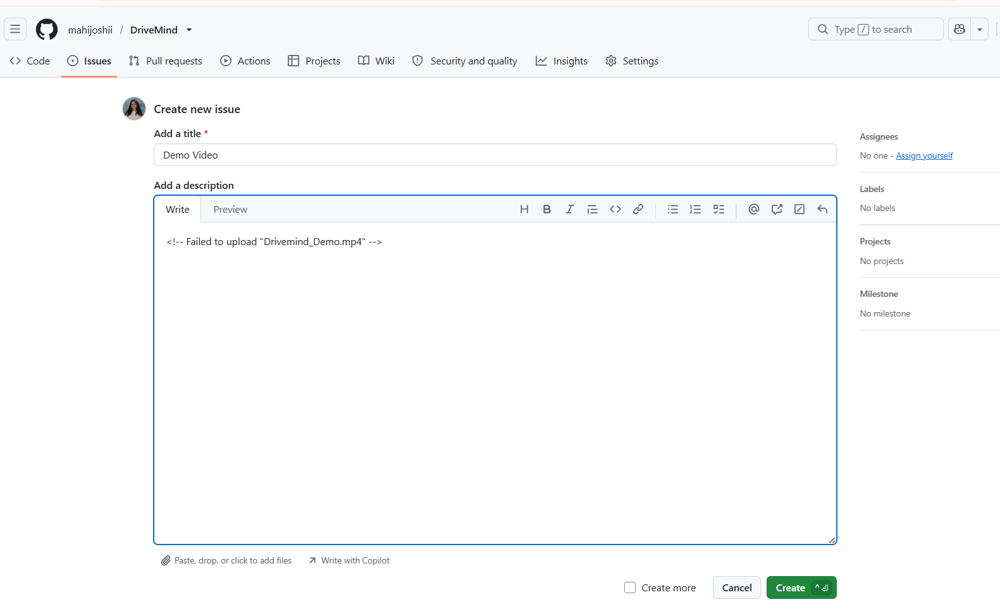
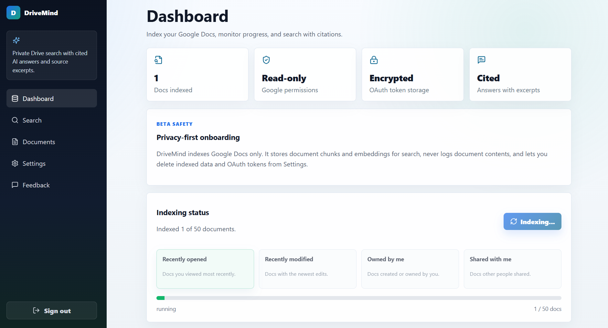
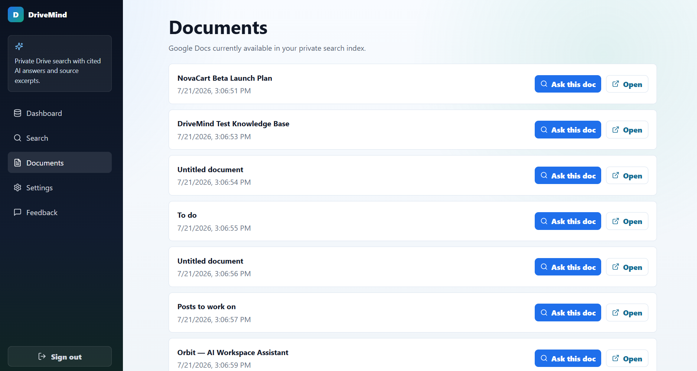
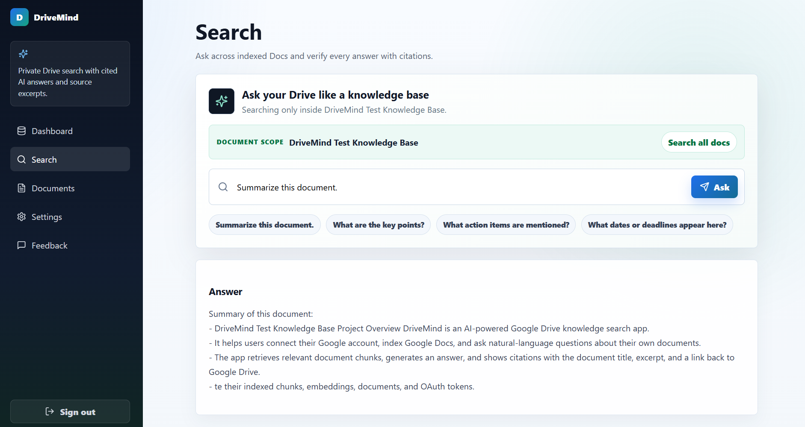
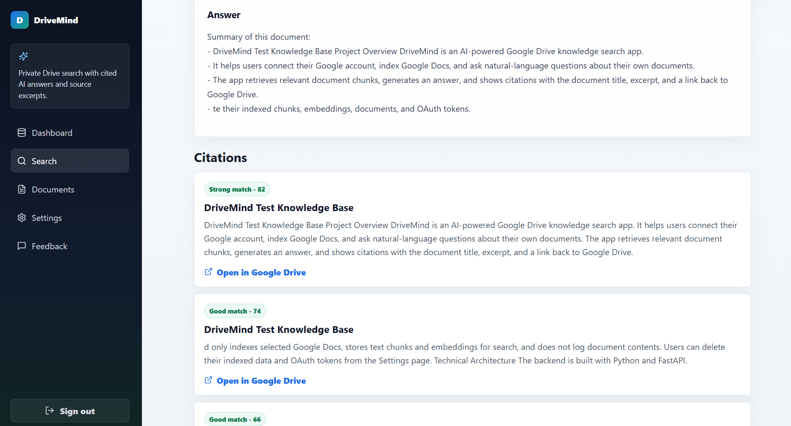
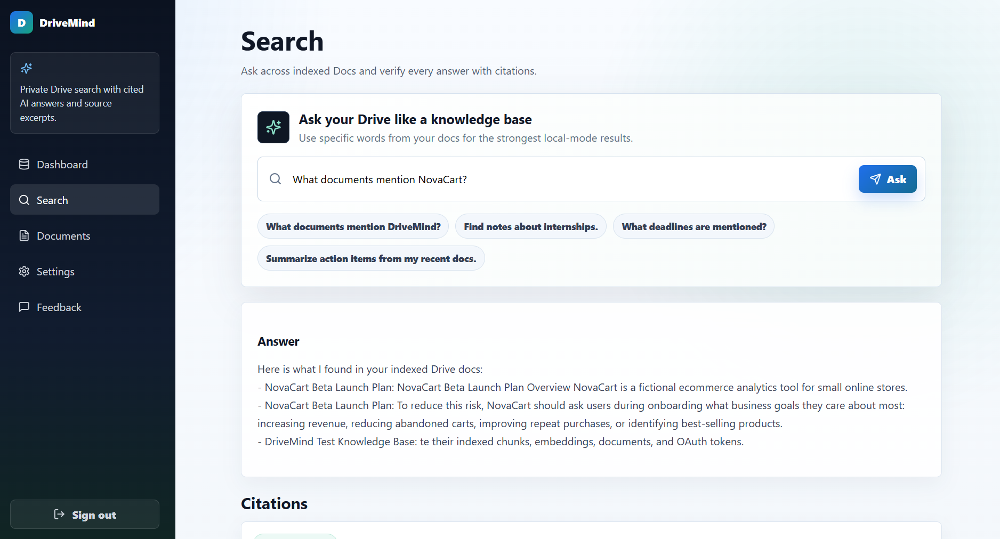
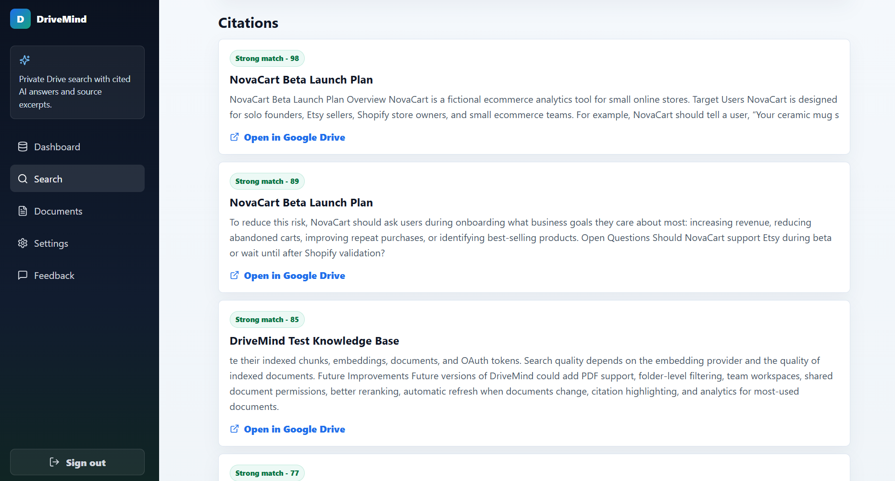
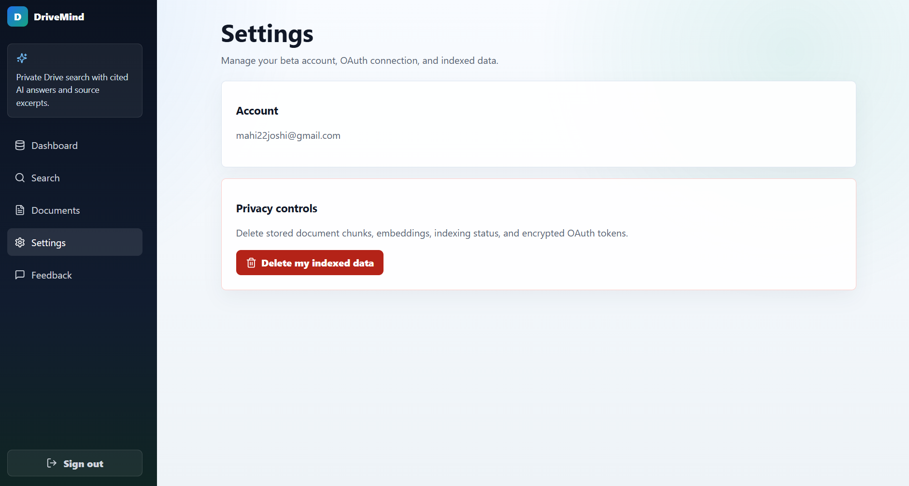
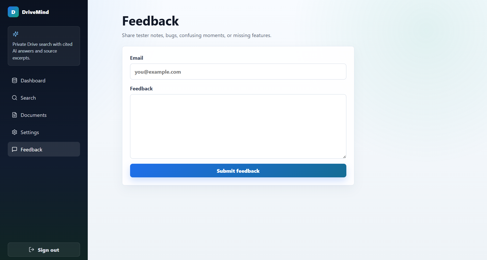

# DriveMind

DriveMind is an AI-powered Google Drive knowledge search app that turns private Google Docs into a searchable, cited knowledge base.

Users sign in with Google, index selected Google Docs, ask natural-language questions, and get grounded answers with citations that link back to the original Drive files.

## Demo

[Watch the DriveMind demo](https://drive.google.com/file/d/1COz-9pcUn4Zbc0Hsy5bFRFn6pqVQpxO3/view?usp=sharing)

## Screenshots

### Landing

Privacy-first Google Drive search with a clean beta-product landing page.



### Indexing Dashboard

Users can index recently opened, recently modified, owned, or shared Google Docs while viewing progress.



### Indexed Documents

DriveMind shows every indexed document with actions to ask inside one doc or open the original in Google Drive.



### Ask One Document

Document-scoped search supports summaries, key points, action items, and date/deadline questions.



### Cited Answers

Answers include citation cards with match strength, source title, excerpt, and an Open in Google Drive link.



### Search Across Drive

Users can search across all indexed docs and compare relevant results from multiple files.





### Privacy Controls

Users can delete indexed chunks, embeddings, indexing status, and encrypted OAuth tokens.



### Feedback

Built-in tester feedback makes the beta easier to improve with real users.



## Features

- Google OAuth 2.0 sign-in with read-only Drive and Docs scopes
- Google Drive indexing for Docs the user recently opened, modified, owns, or has shared
- Google Docs API text extraction, chunking, embeddings, and retrieval
- AI answer generation with citations and excerpts
- Document-scoped search and global Drive search
- Delete indexed data and OAuth tokens from Settings
- Tester feedback form
- Docker-ready backend and frontend

## Tech Stack

- Backend: FastAPI, SQLAlchemy, PostgreSQL, SQLite fallback
- Frontend: React, TypeScript, Vite
- Google APIs: OAuth 2.0, Drive API, Docs API
- AI: provider abstraction for dummy local mode, OpenAI, or Gemini
- Embeddings: provider abstraction with local fallback
- Search: pgvector-ready architecture with Python cosine similarity fallback
- Deployment: Docker, docker-compose, Vercel-friendly frontend

## Local Setup

Backend:

```bash
cd backend
python -m venv .venv
.venv\Scripts\activate
pip install -r requirements.txt
copy .env.example .env
uvicorn app.main:app --reload
```

Frontend:

```bash
cd frontend
npm install
copy .env.example .env
npm run dev
```

Local URLs:

- Frontend: `http://localhost:5173`
- Backend: `http://localhost:8000`
- Health check: `http://localhost:8000/health`

## Required Environment Variables

```bash
GOOGLE_CLIENT_ID=
GOOGLE_CLIENT_SECRET=
GOOGLE_REDIRECT_URI=http://localhost:8000/auth/callback
DATABASE_URL=sqlite:///./drivemind.db
AI_PROVIDER=dummy
EMBEDDING_PROVIDER=dummy
APP_ENV=local
FRONTEND_URL=http://localhost:5173
BACKEND_URL=http://localhost:8000
```

Optional:

```bash
OPENAI_API_KEY=
GEMINI_API_KEY=
```

## Google Cloud Setup

1. Create a Google Cloud project.
2. Enable Google Drive API and Google Docs API.
3. Configure the OAuth consent screen.
4. Add yourself under Test users while the app is in testing mode.
5. Create a Web OAuth client.
6. Add `http://localhost:8000/auth/callback` as an authorized redirect URI.
7. Copy the client ID and client secret into `backend/.env`.

Required scopes:

- `openid`
- `email`
- `profile`
- `https://www.googleapis.com/auth/drive.metadata.readonly`
- `https://www.googleapis.com/auth/documents.readonly`

## Deployment

- Backend: deploy the FastAPI service to Render, Railway, Fly.io, or another Docker/Python host.
- Database: use managed PostgreSQL in production.
- Frontend: deploy the `frontend` folder to Vercel and set `VITE_API_URL` to the backend URL.
- Google OAuth: add the production callback URL to Google Cloud before testing deployed login.

## Privacy Notes

- DriveMind requests read-only Google permissions.
- OAuth tokens are encrypted before storage.
- Document contents are not written to backend logs.
- Users can delete indexed documents, chunks, embeddings, and stored Google tokens.
- Dummy AI and embedding modes are available for local demos without paid API calls.

## Known Limitations

- The MVP indexes Google Docs only.
- Large Drive accounts should use a worker queue for production-scale indexing.
- Local search uses Python similarity; native pgvector retrieval is the next production hardening step.

## Future Improvements

- PDF, Slides, Sheets, and OCR support
- Incremental Drive sync
- Team workspaces
- Better reranking and citation highlighting
- Admin analytics without logging document contents

