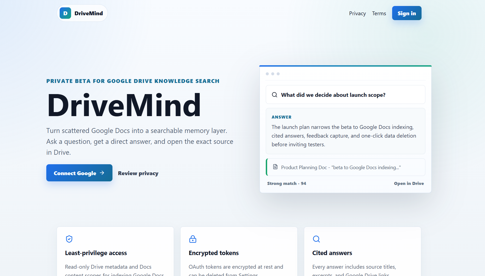

# DriveMind

DriveMind is an AI-powered Google Drive knowledge search app that turns private Google Docs into a searchable, cited knowledge base.

Users connect Google, index Google Docs from Drive, ask natural-language questions, and receive grounded answers with citations that include document title, Drive link, and relevant excerpt.

## Demo

[Watch the DriveMind demo](https://drive.google.com/file/d/1COz-9pcUn4Zbc0Hsy5bFRFn6pqVQpxO3/view?usp=sharing)

## Demo Screenshots



More screenshots coming soon: dashboard indexing progress, search answers with citations, and settings privacy controls.

## Architecture

- Frontend: React, TypeScript, Vite, responsive SaaS-style UI.
- Backend: FastAPI with modular auth, Google API, ingestion, embeddings, retrieval, AI, users, and feedback packages.
- Database: PostgreSQL in production, SQLite fallback for local development.
- Auth: Google OAuth 2.0 with encrypted token storage.
- Google APIs: Drive API lists Google Docs metadata, Docs API extracts document text.
- AI: `AI_PROVIDER=dummy`, `openai`, or `gemini`.
- Embeddings: `EMBEDDING_PROVIDER=dummy`, `openai`, or `gemini`.
- Vector search: the local MVP stores vectors as JSON and uses cosine similarity in Python. The Docker stack uses the pgvector Postgres image and initializes the extension so pgvector-backed retrieval can be promoted without changing deployment topology.

## Local Setup

Backend:

```bash
cd backend
python -m venv .venv
.venv\Scripts\activate
pip install -r requirements.txt
copy .env.example .env
uvicorn app.main:app --reload
```

Frontend:

```bash
cd frontend
npm install
copy .env.example .env
npm run dev
```

Full stack with Docker:

```bash
copy backend\.env.example backend\.env
docker compose up --build
```

Local URLs:

- Frontend: `http://localhost:5173`
- Backend: `http://localhost:8000`
- Health check: `http://localhost:8000/health`

## Google Cloud Setup

1. Open [Google Cloud Console](https://console.cloud.google.com/).
2. Create or select a project.
3. Enable Google Drive API.
4. Enable Google Docs API.
5. Go to APIs & Services -> Credentials.
6. Create OAuth client ID.
7. Choose Web application.
8. Add authorized redirect URI: `http://localhost:8000/auth/callback`.
9. For production, add your deployed backend callback URL, for example `https://api.yourdomain.com/auth/callback`.
10. Copy the client ID and client secret into `backend/.env`.

Required OAuth scopes:

- `openid`
- `email`
- `profile`
- `https://www.googleapis.com/auth/drive.metadata.readonly`
- `https://www.googleapis.com/auth/documents.readonly`

## OAuth Consent Screen

1. Go to APIs & Services -> OAuth consent screen.
2. Select External if testers are outside your Google Workspace.
3. Add app name: DriveMind.
4. Add user support email and developer contact email.
5. Add the scopes listed above.
6. Add links to your deployed Privacy Policy and Terms pages.
7. Keep the app in Testing while recruiting private beta testers.

## Adding Test Users

While the OAuth app is in Testing:

1. Open OAuth consent screen.
2. Go to Test users.
3. Click Add users.
4. Add each tester's Google email address.
5. Save changes.

Only added test users can complete OAuth until the app is published.

## Deployment Guide

Backend on Render, Railway, or Fly.io:

1. Create a PostgreSQL database.
2. Use the backend Dockerfile or a Python service running `uvicorn app.main:app --host 0.0.0.0 --port $PORT`.
3. Set environment variables:
   - `GOOGLE_CLIENT_ID`
   - `GOOGLE_CLIENT_SECRET`
   - `GOOGLE_REDIRECT_URI`
   - `DATABASE_URL`
   - `AI_PROVIDER`
   - `EMBEDDING_PROVIDER`
   - `OPENAI_API_KEY` optional
   - `GEMINI_API_KEY` optional
   - `APP_ENV=production`
   - `FRONTEND_URL`
   - `BACKEND_URL`
   - `SECRET_KEY`
   - `TOKEN_ENCRYPTION_KEY`
4. Add the production callback URL in Google Cloud OAuth credentials.
5. Confirm `/health` returns `{ "ok": true }`.

Frontend on Vercel:

1. Import the `frontend` directory as the Vercel project root.
2. Set `VITE_API_URL` to your deployed backend URL.
3. Deploy.
4. Set backend `FRONTEND_URL` to the Vercel URL.
5. Add the Vercel Privacy and Terms URLs to the OAuth consent screen.

Switching OAuth from Testing to Production:

1. Finish app branding, privacy policy, terms, and domain verification.
2. Make sure requested scopes match the app behavior.
3. Submit for Google verification if Google requires it for the selected scopes.
4. Publish the OAuth consent screen after approval.

## Privacy and Security Notes

- DriveMind requests read-only access only.
- OAuth access and refresh tokens are encrypted before storage.
- Document chunks and embeddings are stored to power search.
- Backend error logs include user and file IDs where useful, but never document contents.
- Users can delete indexed data and stored OAuth tokens from Settings.
- Basic in-memory rate limiting is applied to query requests.
- For production, use HTTPS, strong secrets, managed Postgres backups, and provider-level monitoring.

## Known Limitations

- Indexing runs as a FastAPI background task. For larger beta cohorts, move indexing to Celery, RQ, or a cloud worker queue.
- Retrieval currently uses Python cosine similarity over stored JSON vectors. The compose stack includes pgvector, and the next production hardening step is native pgvector similarity queries.
- Only Google Docs are indexed in the MVP. PDFs, Sheets, Slides, and files with OCR are future work.
- Dummy AI and embedding modes are for development only.

## Future Improvements

- Native pgvector retrieval with approximate indexes.
- Worker queue with per-file retry tracking.
- Incremental sync from Drive changes API.
- Support PDFs, Sheets, Slides, and uploaded docs.
- Team workspaces and shared indexes.
- Admin analytics without document-content logging.

